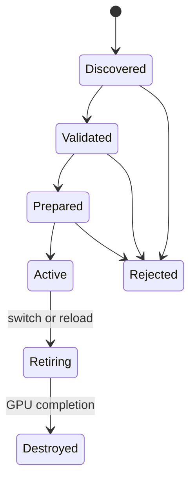

# Ray Pack Architecture

Status: design, with an implementation slice in progress on the `pack` branch. Supersedes the previous
revision; earlier implementation work is being reconciled against this one, not preserved as-is.
Scope: the boundary between the Caustica runtime and installable ray-tracing packs.

### Implementation status

What actually exists right now, so this stays a design doc and not a claim about the renderer:

- **Pack API 0.1 Slang contract** (section 4): `caustica_ray_pack_api.slang` matches every ownership
  decision below — materials engine-decoded, the BSDF/estimator kept separate from `evaluateResponse`'s
  look policy, `PACK_EVENT_*` lobe flags in place of a double-count gate the pack could set directly. The
  bundled default pack implements it.
- **Runtime compilation is real, not aspirational.** `RayPackShaderCompiler` extracts the production world
  shaders and the pack sources to disk and drives the pinned Slang compiler (`causticaslang` shim,
  `SlangSession.compileSpecialized`/`compile`) at runtime — not a synthetic stand-in. `pack_sky_miss.slang`
  is a real, engine-owned entry point in `shaders/pipelines/world/` that imports the production
  `world_common`/`bindings`/`sky` modules, gets specialized with the active pack's concrete type, and is
  bound into the actual world pipeline behind `caustica.rt.packSky` — confirmed rendering in a real frame.
  A second toggle, `caustica.rt.dynamicWorldShaders`, additionally moves every other world-pipeline stage
  (primary/indirect/guide/closest-hit/any-hit) to the same runtime path with its content unchanged, so the
  compile pipeline is proven independent of whether any pack code actually runs yet. Each stage falls back
  to its build-time SPIR-V independently if runtime compilation fails.
- **M2 epoch lifecycle** (section 9): `RayPackEpoch`/`RayPackDiscovery`/`RayPackEpochManager` exist and are
  wired into `RtComposite` for the sky-miss path — validate-then-swap activation, deterministic
  duplicate-pack discovery, bundled-default fallback with a log-and-revert on compile failure.
- **The former "engine/0.1" reference-implementation sketch is gone.** It was a synthetic ~230-line
  stand-in for the integrator/light-service split (one surface vertex, streaming RIS over caller-supplied
  candidates, one homogeneous medium segment) that nothing in the renderer ever called. Keeping it invited
  confusion with the actual production shaders it was meant to preview. The real path forward is Phase B
  below: make the production `closest_hit`/`indirect.rgen` generic over `TPack` directly, rather than
  evolving a second copy.
- **Not yet done**: M1's frame graph (section 10) — `RtComposite` still owns the pass sequence and its
  barriers directly. The production shaders still contain their own independent, hand-tuned implementation
  of surface shading, dielectric interfaces, and RIS lighting for every stage but the sky — they do not yet
  call through the Pack API for materials or lighting. That is Phase B: making `closest_hit.rchit.slang` and
  `indirect.rgen.slang` themselves generic over `TPack`, which needs real perf measurement (register
  pressure from an inlined pack closure) that a real Vulkan-capable environment has to verify.

## 1. Thesis

Caustica becomes a ray-tracing runtime with a bundled reference pack. The bundled pack provides the default
look and receives no privileged access: it is loaded, validated, compiled, and executed through the same
contract as an external pack.

This is not the Iris model. A path tracer has expensive, stateful services whose correctness depends on
global coordination — world extraction, geometry residency, BLAS/TLAS/OMM, light collection, temporal
history, denoising and upscaling, Vulkan scheduling, and color management. Those stay engine-owned, along
with the path integrator and the direct-lighting estimator. The pack supplies appearance.

> The engine owns invariants and global mechanisms; a pack owns appearance policy.

A pack ships **Slang source**, not SPIR-V. At activation the engine loads the pack module, specializes its own
generic entry points with the pack's concrete type, links, and emits SPIR-V internally. SPIR-V is an engine
implementation detail, never a pack format.

The motivation is concrete. Feature work today (clouds, fog, weather, DH, NRD) lands by editing `RtComposite`,
`WorldPush`, and the monolithic ray-generation shaders, so every feature costs the same central files and the
result is a fork rather than a contribution. A pack boundary turns those forks into installable packs, and
lets look decisions be authored rather than exposed as engine knobs.

## 2. Ownership

### 2.1 Table

| Domain | Engine | Pack |
|---|---|---|
| Minecraft integration | Camera, time, dimension, biome, weather, entity/chunk extraction | Visual response to that state |
| Geometry | Mesh ingestion, residency, rebasing, LOD, BLAS/TLAS, OMM, visibility | Nothing directly |
| Materials | Discovery, decoding, merging, canonical pages, material IDs, core attributes | Interpretation of those attributes |
| Lights | Emitter discovery, spatial structures, estimators (RIS/ReSTIR), shadow queries | BSDF/emission evaluated by the estimator |
| Transport | Path state, bounce loop, MIS, Russian roulette, medium stack, dielectric interfaces | Shading contribution and continuation lobe at a vertex |
| Render products | All products, conventions, encodings, history semantics | Scene radiance only |
| GPU memory & scheduling | Allocation, aliasing, barriers, queues, dispatch, history rotation | Declared compute stages: dependencies and hints only |
| Reconstruction | Backend selection, DLSS-RR/NRD/FSR integration, resource lifetime | Nothing |
| Color & presentation | Working space, ACES SDR/HDR output, PQ, UI, screenshots, frame generation | Scene calibration, LMT, exposure policy, bloom |
| Configuration | Pack selection, hardware, performance, display, diagnostics | Optional pack settings and presets |

### 2.2 Known features

| Feature | Owner |
|---|---|
| Nether/End sky, fog, clouds, precipitation appearance | Pack |
| Water wave shape, caustic response | Pack |
| Bloom character, exposure curve, LMT, photometric anchors | Pack |
| BSDF and SSS character, material interpretation | Pack |
| Biome moisture, cave openness, environment fields | Engine database |
| ReSTIR DI, global/spatial RIS, radiance caches | Engine lighting service |
| NRD, FSR, DLSS-RR, DLSS-FG | Engine |
| Distant Horizons, engine-native LOD, BLAS slabs, visibility islands | Engine |
| Dielectric interfaces (Fresnel, refraction, medium stack) | Engine |
| Material JSON | Resource pack + engine compiler |
| SDR/HDR output transforms | Engine |

## 3. Engine services

Services are opaque. A pack cannot name, enumerate, require, prefer, or detect one. The engine selects
implementations from hardware and user quality settings; the selection is visible only in diagnostics and
cache identity.

**Frame** — camera transforms (current and previous), rebased positions, render/display extents, jitter,
frame index, partial tick, epochs and history-reset sequence, pre-exposure, camera medium, debug flags.
Values that change per frame are separated from values that change only at an epoch boundary. Pack constants
do not live here; they live in the pack parameter block.

**Scene** — terrain/fluid/entity/particle and optional distant geometry, stable identities, camera-relative
rebasing, BLAS build/refit/compaction, TLAS assembly, OMM and its fallbacks, visibility filtering, world
epoch propagation. Packs never decode instance indices, device addresses, or geometry tables. A future
scene-provider API lets DH/Voxy/engine LOD contribute geometry; that is a mod-integration API, not a pack
API, and once geometry enters the scene service every pack sees it identically.

**Environment** — the pack-facing world database: dimension identity and sky classification, height range,
rain/thunder/wind/day phase, biome temperature and downfall, camera water tint and medium, column surface
height/moisture/precipitation with validity, a conservative openness estimate, and **stable world-space and
time anchors for procedural animation**. Exposed as `environmentAt(position)`, never as a texture layout.
Spatial fields declare resolution, update, validity, fallback, and teleport semantics.

**Light** — emitter collection, stable identities, absolute radiance, proposal structures, shadow and
transmittance queries, estimator PDFs, MIS, reservoirs, temporal/spatial reuse, validation. Global RIS,
spatial RIS, ReSTIR, and a reference estimator are implementations of one service. The estimator calls the
pack's BSDF to evaluate its target function.

Persistent lighting state never stores a pack closure. A reservoir stores engine facts — light identity,
sample point, proposal/target terms, age, visibility metadata, epoch tags — and re-evaluates against the
current closure on reuse. This keeps pack types out of any cross-frame ABI.

**Integrator** — primary ray generation and jitter, path and payload state, the bounce loop and continuation
queues, ray-cone propagation, the medium stack, dielectric interfaces, direct-lighting invocation, MIS
policy, Russian roulette, double-count prevention, guide and product production, pre-exposure at the storage
boundary, SER and other execution variants.

**Reconstruction** — backend selection and lifetime across vendor SDKs and native libraries. Profiles:
`reference`, `combined-radiance`, `split-radiance`, `ray-reconstruction`. Pack code never calls NGX, NRD,
FSR, Streamline, or presentation APIs.

**Color and presentation** — the working image is scene-linear ACEScg in absolute Caustica scene units. The
engine owns pre-exposure, ACES SDR and HDR output transforms, PQ encoding, HDR swapchain selection, UI
paper-white and composition, frame generation handoff, screenshots, and display adjustment. Packs never
produce sRGB, PQ, or tonemapped color as their scene result.

## 4. The pack contract

### 4.1 Surface and shading

The pack turns a canonical material into a closure, evaluates and samples it, and defines how a shaded
contribution looks. Two things are deliberately separated:

- **The BSDF is the estimator's target function.** RIS candidate weighting, ReSTIR reuse, and MIS all depend
  on it. It must be finite, non-negative in pdf, and consistent between `evaluate` and `sample`, or every
  engine lighting backend is biased.
- **The response is the look.** Quantization, banding, palette snapping, cel thresholds — applied to a shaded
  contribution, not to the BSDF. Non-physical by design and unconstrained.

This split lets a stylized pack be arbitrarily non-physical without biasing the estimator.

As shipped in `caustica_ray_pack_api.slang` (API 0.1), a closure with `transmission > 0` never reaches
`evaluateBsdf`/`sampleBsdf` at all — see 4.4 — and lobe classification travels as the pre-existing
`PACK_EVENT_*` bitflags rather than a new enum, so `IPackSurfaceModel` reads:

```slang
public interface IPackSurfaceModel {
    // Interpretation of the canonical material. All pack material policy lives here.
    public float evaluateCoverage(PackSurfaceInput input);
    public PackSurfaceClosure createSurface(PackSurfaceInput input);

    // Estimator contract. value and pdf must agree; pdf >= 0; both finite. Never called with a
    // transmissive closure — the engine routes those through its own dielectric interface instead.
    public PackBsdfEvaluation evaluateBsdf(PackBsdfQuery query);
    public PackBsdfSample sampleBsdf(PackBsdfSampleQuery query);   // weight, direction, PACK_EVENT_* flags

    // Look. Applied by the engine to an already-shaded contribution. Never used by the estimator.
    public float3 evaluateResponse(float3 radiance, PackSurfaceClosure surface);
};

public interface IRayPack : IPackSurfaceModel, IPackEnvironmentModel, IPackMediumModel {};
```

`shadingNormal`/`demodulationAlbedo` (section 6) are not yet separate query points — the engine currently
reads `PackSurfaceClosure.shadingNormal`/`diffuseAlbedo` directly off the closure the pack already built for
shading, per the accepted default in 6.1. Splitting them out is a compatible addition for whenever a pack
actually needs to diverge, not something built ahead of that need.

There is no `IPackIntegrator` and no `IPackDirectLighting`. Specialization is static: the engine specializes
its generic entry points with the concrete pack type, so calls inline and unused paths are removed. No
per-hit runtime dispatch.

### 4.2 The loop contract

The engine owns the bounce loop; the pack fills the shading body. Some loop values look like appearance but
are correctness, and the pack must not set them directly:

| Loop value | Owner | Why |
|---|---|---|
| `L`, throughput, pdf division | Engine | Energy bookkeeping |
| Russian roulette, bounce cap | Engine | Termination policy |
| Medium attenuation, medium stack | Engine | Beer–Lambert, push/pop correctness |
| Ray cone width and spread | Engine | Filtering and LOD consistency |
| **Celestial disc visibility** | Engine, derived from `PACK_EVENT_*` flags | A diffuse bounce already accounted for the sun via NEE; showing the disc again double-counts it |
| **Emitter direct-hit gating** | Engine, derived from RIS participation | An emitter sampled by RIS must not also be gathered on hit; an emitter *not* sampled must always gather, or its light is lost |
| Contribution at a vertex | Pack | Appearance |
| Continuation direction and weight | Pack | Appearance |
| Lobe classification (`eventFlags`) | Pack | Input to the two gates above |

These are engine invariants, not yet implemented: the production `indirect.rgen.slang` already computes
both correctly today (`showCelestial`/the emitter-in-list bit), but as hand-tuned local logic that assumes
its own BSDF branches, not as functions derived from a pack's `eventFlags` the way this section describes.
Making that derivation explicit and pack-type-generic is part of Phase B, alongside making the surface/BSDF
call sites themselves generic over `TPack`. A pack that could set either gate directly could silently
double-count or lose light, and the symptom is "this pack is brighter," not a visible failure — which is
why the derivation belongs on the engine side of the boundary once that refactor happens, not left as an
invariant the pack is merely asked to respect.

### 4.3 Environment

```slang
public interface IPackEnvironment
{
    float3 evaluate(EnvironmentInput input);   // sky, background, celestial bodies
}
```

The sky is evaluated in the primary pass for background pixels. That is the one place pack code runs during
primary-hit processing, and it writes radiance only — never a guide.

### 4.4 Medium and dielectric interfaces

**Dielectric interface behaviour is engine-owned in full**: Fresnel, reflection/refraction choice, total
internal reflection, medium push/pop, and the surface-bias regimes. The medium stack stays engine-side and
out of the pack closure's live register set. `indirect.rgen.slang`'s existing dielectric branch already
implements exactly this policy — it is the reference for what a pack-generic `engineSampleDielectricInterface`
should factor out of it in Phase B, not a gap to invent from scratch.

The pack supplies two narrow things: medium coefficients plus a full phase-function estimator (not just a
phase parameter — volume NEE needs eval/sample/pdf under the same contract as the BSDF), and a normal
perturbation hook for animated interfaces such as water waves:

```slang
public interface IPackMediumModel {
    public PackMedium createMedium(PackMediumInput input);            // scattering, absorption, ior, anisotropy
    public PackPhaseEvaluation evaluatePhase(PackPhaseQuery query);    // value, pdf — must agree, like the BSDF
    public PackPhaseSample samplePhase(PackPhaseSampleQuery query);
    // Not yet shipped: a perturbNormal(geometricNormal, InterfaceInput) hook. The engine must call it from
    // both guide generation and shading with the same inputs, or the reflection/refraction guides desync
    // from the shaded image — see the accepted-limits note below.
};
```

`createMedium`/`evaluatePhase`/`samplePhase` are implemented and compiled as of this revision (section
"Implementation status"). `perturbNormal` is not — there is currently no water-wave callback in this Pack
API slice at all, so this remains a documented gap rather than an implemented, accepted inconsistency.
Whichever pack eventually needs animated interface normals should add it as a compatible interface extension,
with the "must match guide and shading" invariant enforced from day one rather than retrofitted.

Consequence, accepted: a pack cannot stylize refraction. The engine's transmission-chain walk selects the
guide branch and uses material IOR, so a pack that wanted exaggerated or absent refraction would have guides
describing different geometry than what it shaded.

### 4.5 Look

The pack owns photometric anchors within engine representability, automatic-exposure policy and curve, the
scene-referred LMT, and bloom policy. All of it is scene-referred and precedes the fixed engine display
transform.

### 4.6 Pack compute stages

A pack may declare compute entry points at approved graph hooks. The engine compiles each through a separate
compute-stage contract, allocates its logical resources, binds semantic inputs, derives dispatch and
synchronization, and records it. Ray generation, intersection, any-hit, closest-hit, miss, callable, raster,
and mesh stages remain forbidden. Pack compute cannot call or replace the integrator or influence
direct-lighting selection.

A declaration carries: a pack-local ID, one hook, one entry point, semantic reads/writes, dispatch extent, an
optional queue hint, optional temporal-resource use, and a fallback policy. It cannot declare ray tracing,
raster, transfer, presentation, or a dependency on a private engine node.

Ordering of the first stages, easiest coupling first:

1. **Bloom** at the `look` hook. A migration of an existing pass with a parity target, reading one
   scene-linear image and writing one, with no engine consumer downstream except display mapping. It
   exercises the full machinery — manifest declaration, hook admission, engine-allocated pack-local
   resources, reflection validation, derived dispatch and barriers — with no way to corrupt engine state.
2. **Sky/atmosphere preparation** at `environment-prepare`. Harder, because the transmittance LUT is not a
   leaf: engine sun NEE derives its illuminance from it. Pack compute output feeding engine direct lighting
   needs a validation and fallback story, which is why it goes second.
3. **A pack-local temporal effect**, to exercise engine-managed history rings.

## 5. Materials

**Materials are content; packs are interpretation.** Definition belongs to Minecraft resource packs plus the
engine material compiler. A ray pack contributes no material defaults and no material file of its own.

The engine owns sprite and texture discovery, LabPBR and other source-format decoding, resource-pack priority
and JSON merging, canonical texture pages and mips, stable material IDs within a resource epoch, core surface
attributes and sampling, alpha coverage for geometry and OMM, and material lifetime.

The pack receives a canonical surface description: base color and opacity, shading and geometric normal,
linear roughness, metalness or conductor class, IOR and transmission, emission mask/color/absolute luminance,
AO and subsurface hints, semantic tags (water, particle, foliage, portal), and previous-frame motion where
available. It owns the BSDF and the artistic reading of those attributes.

Merge order:

1. engine safety and representability constraints;
2. highest-priority resource-pack material metadata;
3. source-format data such as LabPBR;
4. engine heuristics and vanilla fallback.

Pack-specific policy — "foliage gets more SSS," "metals get a higher F0 floor" — is expressed in `make()`
keyed on semantic tags, not in a data file. That is more expressive than a defaults file and removes the
ambiguity of two systems both describing a complete surface.

If a pack needs per-block data the canonical attributes do not carry (a stylization group, a palette index),
that is an **opaque extension namespace in the resource pack**. The engine defines the format and the merge;
the pack assigns meaning. The ray pack never defines material data.

## 6. Render products

**The pack produces, defines, and reinterprets no canonical render product except scene radiance.** The
engine writes every product and owns every convention: working space, radiometric unit and pre-exposure
status, resolution, encoding and valid range, background convention, motion direction and coordinate space,
depth convention and invalid value, which surface event the value describes, and history-reset semantics.
Those conventions matter more than the formats — most reconstruction bugs are two components agreeing on
`RG16F motion` and disagreeing about sign or space.

Core products: `sceneRadianceCombined`; `sceneRadianceDiffuse`/`Specular` as an optional pair;
`diffuseHitDistance`/`specularHitDistance`; `firstHitDepth`; `firstHitMotion`; `firstHitNormalRoughness`;
`firstHitDiffuseAlbedo`; `firstHitSpecularAlbedo`; optional `reflectionMotion`, `disocclusionHint`,
`reactiveMask`; and a metadata record carrying pre-exposure and reset sequence.

The engine may query exactly two values from the pack while filling guides:

- **`shadingNormal`** — because water wave perturbation must appear in the normal guide or the denoiser
  mistracks reflections.
- **`demodulationAlbedo`** — because demodulation is a contract between what the pack multiplies by and what
  the denoiser divides by, not a free image.

### 6.1 Accepted inconsistencies

Both are deliberate, both have a named escape:

- **`demodulationAlbedo` is engine-derived for now** (`albedo * (1 - metal)`), with the interface point
  defined and a default implementation so a pack can override it later without an API break. Assumed
  invariant: pack diffuse response is proportional to `albedo * (1 - metal)`. When a pack violates it — a
  palettized or heavily tinted diffuse response — residual texture stays in the demodulated irradiance and
  DLSS-RR either over-blurs it or smears it as ghost texture. It presents as a denoiser bug and is not one.
- **Refraction is not stylizable** (section 4.4). Add a guide-branch callback only if a pack needs it.

### 6.2 Negotiation

At activation the engine enumerates backends, applies user preference against device support, chooses the
required product set, checks the pack surface type for the semantic information that set needs, specializes
its wrappers for the pack and product profile, instantiates only needed products, and falls back to a
reference profile if the preferred backend fails. Backend failure at runtime requires a graph and history
reset, never a geometry rebuild or pack reload.

A stylized pack may need a reduced-reconstruction profile: quantized lighting fed to a temporal denoiser
either gets smoothed back into gradients or aliases along band edges. Profile negotiation is where that is
resolved.

## 7. Pack artifact and manifest

```text
example-pack.crp
  pack.json
  shaders/
    pack.slang, surface.slang, environment.slang, medium.slang
    compute/bloom.slang
  look/        look.json, lmt.bin
  settings/    settings.json, presets.json
  assets/      textures/, noise/
  licenses/
```

Required properties: one root manifest; namespaced assets; Slang source implementing versioned engine
interfaces; no Java or native code; no pack-supplied SPIR-V, descriptor layout, or pipeline metadata; no
material definition files.

```json
{
  "format": 1,
  "id": "caustica:default",
  "version": "0.1.0",
  "api": { "major": 0, "minor": 1 },
  "slang": { "module": "default_pack", "type": "DefaultRayPack", "sourceRoot": "shaders" },
  "lookPackage": "caustica:default",
  "compute": [
    {
      "id": "bloom",
      "hook": "look",
      "module": "compute.bloom",
      "entryPoint": "main",
      "reads": ["frame", "scene-radiance"],
      "writes": ["pack:bloom-chain"],
      "dispatch": "pack:bloom-chain",
      "queue": "engine-choice"
    }
  ]
}
```

There is no service list, pass list, descriptor declaration, or capability request. `slang` names a module
and a concrete type, never an entry point. `additionalProperties: false` applies at every object boundary, so
misspelled and premature fields fail rather than being ignored.

The engine's shader cache lives outside the pack and is reproducible from pack source plus pinned
engine/compiler inputs.

## 8. Compilation and specialization

The engine ships a pinned Slang compiler and owns every generated binary. Authors and users install nothing.
A compilation coordinator — not scattered Slang calls — performs:

1. create or reuse a session for the API/compiler configuration, with only approved search paths;
2. load engine public and private modules under distinct namespaces;
3. load the pack module from a normalized virtual filesystem;
4. locate the manifest-declared type and verify conformance to `IRayPack` and its associated interfaces;
5. locate the engine generic entry points required by the active renderer configuration;
6. specialize them with the pack type and engine-private lighting/reconstruction types;
7. compose, link, reflect, and validate the resource layout against the engine pipeline contract;
8. emit and validate SPIR-V; create pipelines.

Declared compute stages compile through a **separate** operation — pack entry point plus engine compute
wrapper plus validated semantic bindings — so a compute module can never enter the transport composition.

Reflection is the source of truth for the compiled program, but it is validated against the pipeline contract,
not accepted as permission to bind resources. Appearance modules must contain no entry points and no global
resources; that check is not weakened by the compute path.

Compilation happens at activation, reload, and capability-plan change — never on the render thread or inside a
frame. The active epoch stays live while a candidate compiles. Compilation runs on a dedicated worker with
global-session access serialized.

The coordinator should also report **per-variant register and scratch usage** and fail or warn above a
ceiling. Pack code inlines into the integrator's hot loop; without this, occupancy regressions are invisible
until they show up as frame time.

### 8.1 Cache

Key includes: hashes of all transitively imported pack sources and specialization-affecting assets; API
version; engine module and wrapper hashes; selected integrator/lighting/product specialization types; Slang
compiler version and flags; capability plan and specialization constants; Vulkan target environment. Entries
hold only reproducible engine artifacts. A debug option forces recompilation and compares reflection.

## 9. Lifecycle and epochs



A **pack epoch** is one immutable loaded pack plus its specializations, parameters, assets, and material
interpretation. A **resource epoch** is the Minecraft resource-pack generation behind texture pages and
material IDs. They change independently.

Activation is transactional: validate without touching the active pack; compile and validate every required
variant; allocate persistent resources; rebuild material state if interpretation changed; construct the graph
and validate products; publish one immutable epoch reference; increment the history-reset sequence; retire the
old epoch after its last graphics use. No partially initialized state is ever visible to rendering. A failed
candidate leaves the current pack active.

Reload classes, so an edit is not a device-idle terrain clear:

- **look-only** — LMT, exposure, bloom, parameters; reset affected look history;
- **source/program** — recompose affected entry points, rebuild pipelines and affected histories; keep
  materials and geometry;
- **material-policy** — rebuild material registry and derived geometry metadata;
- **resource-pack** — rebuild texture pages and material IDs, clear dependent geometry;
- **world/dimension** — invalidate world-dependent histories and databases; keep device-level pack assets.

Parameter changes produce a new immutable snapshot; a frame reads one snapshot for its whole lifetime.

## 10. Frame graph

The current frame is a linear recording function with explicit broad barriers, so adding a pass means editing
global scheduling code. The graph makes dependencies declarative and derives synchronization.

**Scope v1 deliberately narrow**: declared passes, derived barriers and layout transitions, temporal
resource rings, a compiled linear schedule, diagnostics and per-pass timings. Defer transient aliasing and
async queue policy — that is where graphs become subtly wrong, and the value is in barrier derivation and
history rotation. Graph construction allocates nothing per frame.

Resource declarations are semantic: name and owner, format class, extent expression (render, display,
half-display, fixed, parameterized), mips and dimensions, usage class, initialization, lifetime
(persistent/transient/temporal), history length and reset policy, resize policy. Never Vulkan flags, memory
types, or handles.

Stable engine stages:

1. `environment-prepare` — world-derived and procedural fields before tracing
2. `before-trace` — light and environment preparation that may consume the frame TLAS
3. `trace` — integrator specialized with the pack
4. `before-reconstruction` — product conditioning
5. `after-reconstruction` — scene-linear volumetrics and temporally filtered effects
6. `look` — exposure, bloom, scene-referred look
7. `debug`

Pack compute stages may be admitted at a reviewed subset — `look` first, then `environment-prepare`. `trace`,
reconstruction execution, display mapping, UI composition, and presentation are fixed engine nodes. Adding a
hook is an API change, not something a manifest can invent.

A queue hint is a hint. The engine may schedule on graphics when overlap will not help, when the compute
queue is busy with terrain builds, or when ownership transfer costs more than it saves. Packs never encode
barriers, semaphores, ownership transfers, or command ordering.

The engine rotates histories only after successful frame submission; a failed or skipped frame never advances
history. Pack switches invalidate histories by engine dependency rules.

## 11. Settings

**Engine**: pack selection, render/reconstruction quality, backend preference, frame generation, HDR and
mastering, display adjustment, budgets, debug and capture tools.

**Pack**: authored quality presets, cloud/fog model choices, stylistic variants. Optional — a pack may expose
none. The engine renders a generic UI from a pack-provided schema (types, labels, ranges, defaults, reload
requirements, visibility conditions, preset membership). The engine does not invent aesthetic knobs; that is
the point of the pack boundary.

Current constants that should become pack-owned: water wave enablement, exposure metering and adaptation
character, bloom character, sky geometry, light anchors. Manual exposure, reconstruction quality, HDR peak,
and display adjustment stay engine.

## 12. Validation, failure, telemetry

Validation layers, in order: archive structure and path normalization; manifest schema and identifiers; API
compatibility; module namespace and import validation; rejection of pack entry points and global bindings in
appearance modules; Slang parse and interface conformance; specialization and link; post-link reflection
against the pipeline contract; product contract; look/material/settings schemas; SPIR-V validation and
pipeline creation. Declared compute stages add: compute-only stage check, reflected bindings matched exactly
against the semantic declaration, graph hazard and limit checks.

Diagnostics name the pack, artifact path, engine program, expected contract, and actual value, and map back
to pack filenames and lines.

**Failure**: activation failure leaves the previous epoch live; startup failure activates the bundled default;
if that fails, Caustica returns to the vanilla renderer. A CPU-side frame failure latches for the epoch,
prevents history rotation, and falls back. Device-loss reports carry pack identity and hash, capability plan,
compiled graph and current pass, resource sizes and temporal indices, last engine and pack debug labels, and
enabled features — distinguishing engine code from inlined pack functions without assuming either is at fault.

**Limits** are configurable ceilings, not a sandbox: source and archive size, module and import count, texture
dimensions and decoded bytes, settings count, compile time, and for compute stages: stage count, dispatch
bounds, logical resource bytes, descriptor count, history length, total pack-local memory. Arbitrary GPU code
can always hang a device; the engine validates structure and cannot sandbox the GPU.

**Telemetry**: discovery/validation/compilation/pipeline time; per-pass GPU timing and queue placement;
per-variant register and scratch usage; transient peak bytes; persistent and temporal bytes by service and by
pack namespace; descriptor counts; TLAS instances and AS memory; product allocation and bandwidth; history
resets and reasons; activation and reload latency. Compiled program names retain pack ID, pass ID, and epoch
so RenderDoc and Nsight captures stay actionable.

## 13. Roadmap

Strangler pattern: preserve the working renderer, introduce the boundary, move one subsystem at a time. No
time estimates.

**M0 — baseline.** Ownership assigned for every planned feature. Current resources, pass sequence, and private
ABIs inventoried. Reference captures for SDR/HDR, biome, water, entity, and night scenes. API marked
experimental and exact-versioned.

**M1 — frame graph.** Logical resource model, pass and access declarations, derived barriers, temporal
resources, diagnostics and timings, `RtComposite` reduced to lifecycle and orchestration. Preserves the
current pass order and matches reference captures. Pure engine value, no API commitment — which is why it
comes before the pack machinery.

**M2 — epoch and look.** `RtPackEpoch` lifecycle and tracked retirement, manifest and schema validation,
discovery and deterministic selection, bundled-default fallback, look loading through the active epoch,
look-only reload. Exit: no static `LOOK` snapshot; a second look-only pack changes LMT, exposure, bloom, and
anchors with no Java edits; a failed candidate leaves the old pack active.

**M3 — Pack API 0.1 and default extraction.** Public/private module split; engine entry wrappers; surface,
environment, medium, look interfaces; integrator and light service generic over the pack type; parameter
reflection and data-driven upload; compilation coordinator and cache; source-only archive. Hit shaders split:
the wrapper decodes a hit into a public surface structure, the pack interprets it. Exit: the default pack
imports only public modules; private layouts are unreachable from pack source; a second pack changes sky,
surface response, and LMT with no Java changes; both packs use the same runtime path.

**M4 — pack compute.** Manifest compute section, hook admission, pack-local logical resources, reflection and
graph validation, dispatch lowering. Bloom migrates first as a parity-checked leaf stage.

**M5 — environment service and atmosphere.** Immutable per-frame snapshot; dimension, weather, biome, and
attribute inputs; column fields with validity and teleport handling; 3D image support; sky/atmosphere
preparation at `environment-prepare` with a validation and fallback story for the transmittance LUT, since
engine NEE consumes it. Then Nether/End skies, fog, clouds, precipitation in the default pack. Exit: no
atmosphere-specific Minecraft query in pack code; a diagnostic pack can visualize every field; teleport and
dimension changes leave no stale fields.

**M6 — reconstruction service.** Product definitions and negotiation, DLSS-RR behind the service, reference
path, split-radiance, NRD as the boundary test, live fallback. Exit: adding NRD does not touch pack appearance
code; switching backends rebuilds no geometry; depth/motion/normal/roughness/exposure/reset conventions have
contract tests.

**M7 — scene-provider API.** Provider contract, distant-geometry identity/residency/motion, TLAS and
visibility integration, DH or engine LOD proof of concept. Exit: packs see distant geometry with no
provider-specific branches; provider failure falls back safely.

**M8 — Pack API 1.0.** Requires two materially different packs, two reconstruction backends, one advanced
atmosphere or water implementation using callbacks plus pack compute, one pack-local temporal compute effect,
one external scene provider, stable tooling, documented budgets, and a real API upgrade exercising the
deprecation policy.

### 13.1 The second pack

The reference test pack is a **stylized world-space quantized light and sky** look. It is a better forcing
function than a gradient sky because it exercises seams the design asserts and has not proven:

- world-space quantization needs a domain stable under camera motion and terrain rebasing, which validates
  the environment service's stable world anchors — currently a promised field with no consumer;
- banded lighting against a temporal denoiser either gets smoothed back into gradients or aliases along band
  edges, which forces reconstruction profile negotiation to be real;
- a palettized diffuse response is exactly what breaks the `demodulationAlbedo` assumption in 6.1, so the
  test tells you when to implement the callback.

Screen-space stylization is a look-stage post-process and is covered by the bloom migration instead.

## 14. Decisions

1. Exactly one primary pack is active. Resource packs still layer material metadata and textures.
2. The default pack is bundled but ordinary: normal manifest, public imports only, normal lifecycle, no
   privileged binaries or bindings, replaceable without Java changes. Bundling is distribution and fallback,
   not privilege.
3. Packs contain no Java or native code, and distribute Slang source; the engine owns composition,
   compilation, validation, and SPIR-V.
4. The engine owns Vulkan resources, scheduling, reconstruction, presentation, and acceleration structures.
5. The working image is scene-linear ACEScg in Caustica scene units.
6. The path integrator, direct-lighting estimators, and dielectric interfaces are engine services.
7. Specialization is static; there is no runtime pack dispatch.
8. The BSDF must satisfy the estimator contract; the look response is unconstrained.
9. Materials are defined by resource packs and the engine compiler; packs only interpret.
10. Packs produce no canonical render product but scene radiance; the engine may query `shadingNormal` and
    `demodulationAlbedo` only.
11. Pack settings are optional and schema-driven; the engine invents no aesthetic knobs.
12. API versions are exact and experimental before 1.0.

## 15. Open questions

1. How much material opacity policy must be engine-owned for OMM and conservative geometry correctness?
2. Can one canonical `FirstSurface` serve DLSS-RR, NRD, FSR, and reference capture without wasted bandwidth?
3. Which pack parameter changes can apply without rebuilding pipelines?
4. Which logical resource classes and temporal reset dependencies can be public without leaking Vulkan
   layouts?
5. Should compute dispatch extents be engine-derived only, or also bounded pack-parameter-derived?
6. What resource ceilings suit the minimum supported GPU?
7. Should the engine enable a supported optional Vulkan feature superset for hot switching, and at what
   driver-risk cost?
8. Which radiance-cache primitives are general enough to promote into a reusable engine service?
9. What failure evidence would justify an out-of-process compiler host? An in-process native compiler fault
   terminates the game; transactional activation protects against compile and validation failures, not
   process faults.

## 16. Contribution rules

Every substantial feature answers: is this a world fact, an engine invariant, or appearance? Which service or
interface owns it? Does it need a new generally useful engine field, or can pack code derive it? Does it need
a new product or resource? What invalidates its history? What is its fallback? How is its cost measured? Can
the default pack implement it with public APIs only? Can another pack produce a different result from the same
service?

During migration: no new artistic constant in engine frame state when a pack parameter suffices; no new
pack-specific mixin when a service should publish the fact; no pack-authored shader stage outside a declared
compute hook; no manual frame barrier or queue command from pack code; no pack-visible raw buffer layout; no
reconstruction SDK call from pack code; no default-pack special case in the loader or shader API; no new
global user knob added to avoid making an authored decision in the default pack.

## 17. Success criteria

A new look or atmosphere is implementable entirely in a pack plus reusable engine world fields. A new
reconstruction backend is addable entirely behind the service. A geometry provider is addable with no
pack-specific branches. The default pack has no privileged import or runtime path. `RtComposite` stops growing
per visual pass. Invalid packs fail before publication with actionable diagnostics. Default-pack performance
stays competitive with the current fixed renderer. Authors can build, validate, install, profile, and reload a
pack without building the mod. Different packs look genuinely different without duplicating BLAS/TLAS,
denoising, frame generation, Minecraft extraction, or HDR presentation code.

The end state is not a smaller renderer. It is a clearer one: an engine that makes expensive global services
correct and fast, and packs free to make strong authored choices about the image.
